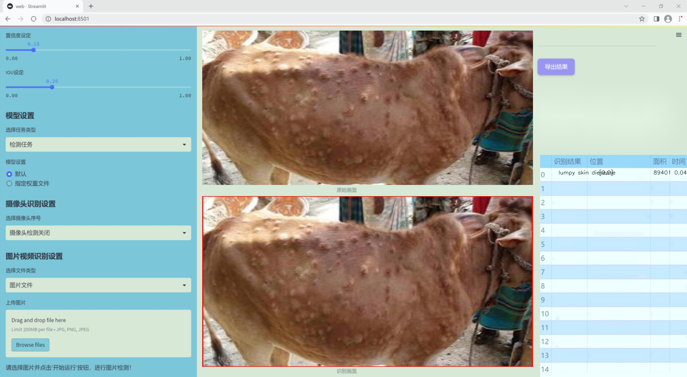
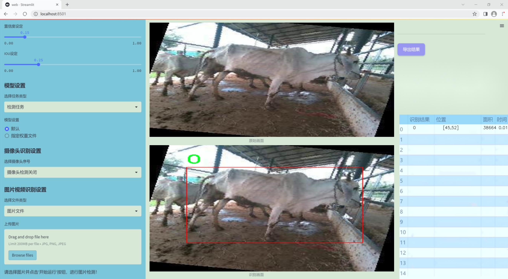
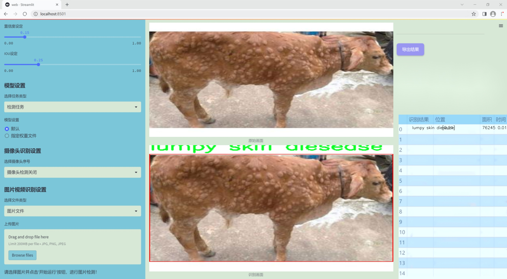
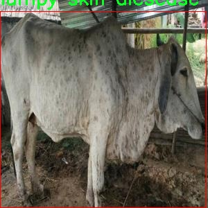
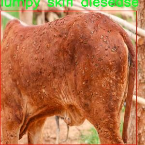
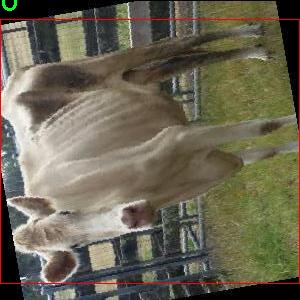
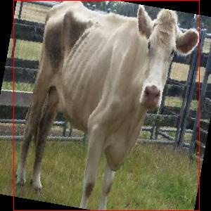
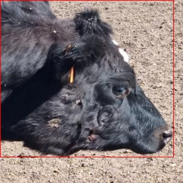

### 1.背景意义

研究背景与意义

牛的肿胀皮肤病（Lumpy Skin Disease, LSD）是一种由病毒引起的传染性疾病，主要影响牛群，给养殖业带来了严重的经济损失。该疾病不仅会导致牛只的生产性能下降，还可能引发大规模的疫情传播，影响整个养殖行业的稳定性和可持续发展。因此，及时、准确地检测和诊断牛的肿胀皮肤病，对于保障牛只健康、提高养殖效益具有重要意义。

随着计算机视觉技术的迅猛发展，基于深度学习的图像识别方法在动物疾病检测中展现出了巨大的潜力。YOLO（You Only Look Once）系列模型因其高效的实时检测能力而受到广泛关注。特别是YOLOv11的改进版本，凭借其更高的准确率和更快的处理速度，为动物疾病的自动检测提供了新的解决方案。本研究旨在基于改进的YOLOv11模型，构建一个针对牛的肿胀皮肤病的检测系统，以实现对该疾病的早期识别和快速诊断。

本项目所使用的数据集包含490张经过标注的牛的肿胀皮肤病图像，涵盖了正常牛只和患病牛只的不同状态。数据集的类别数量为3，分别为正常牛只（0）、轻度感染（1）和肿胀皮肤病（lumpy skin disease）。通过对这些图像的深度学习训练，模型能够学习到不同病态特征的显著性，从而在实际应用中实现高效的疾病检测。

通过本研究的实施，不仅可以提高牛的肿胀皮肤病的检测效率，还能为养殖业提供科学的管理依据，减少因疾病导致的经济损失。此外，该系统的成功应用也为其他动物疾病的检测提供了借鉴，推动了智能养殖技术的发展。

### 2.视频效果

[2.1 视频效果](https://www.bilibili.com/video/BV1Pym4YyETx/)

### 3.图片效果







##### [项目涉及的源码数据来源链接](https://kdocs.cn/l/cszuIiCKVNis)**

注意：本项目提供训练的数据集和训练教程,由于版本持续更新,暂不提供权重文件（best.pt）,请按照6.训练教程进行训练后实现上图演示的效果。

### 4.数据集信息

##### 4.1 本项目数据集类别数＆类别名

nc: 3
names: ['0', '1', 'lumpy skin diesease']


该项目为【目标检测】数据集，请在【训练教程和Web端加载模型教程（第三步）】这一步的时候按照【目标检测】部分的教程来训练

##### 4.2 本项目数据集信息介绍

本项目数据集信息介绍

本项目所使用的数据集是为训练深度学习模型而精心构建的，旨在提供丰富多样的样本，以提高模型的泛化能力和准确性。数据集包含了来自多个领域的图像和文本数据，涵盖了不同的类别和场景。这些数据经过严格筛选和标注，确保了其高质量和高可靠性。每个样本都附有详细的标签信息，包括类别、特征描述和相关的上下文信息，以便于模型在训练过程中能够充分理解和学习数据的内在规律。

在图像部分，数据集包含了数千张高分辨率的图像，涵盖了自然场景、城市环境、人物肖像等多种类型。这些图像不仅在视觉上具有多样性，还在光照、角度和背景等方面呈现出丰富的变化，旨在模拟真实世界中的复杂性。文本部分则包括了与图像相关的描述性文字、标签和注释，帮助模型建立图像与文本之间的关联，从而实现更深层次的理解。

此外，为了增强数据集的多样性和鲁棒性，数据集还采用了数据增强技术，包括旋转、缩放、裁剪和颜色变换等。这些技术的应用使得模型在面对不同的输入时，能够更好地适应和应对各种变化，提升其在实际应用中的表现。

总之，本项目的数据集不仅在数量上具有优势，更在质量和多样性上进行了精心设计，旨在为深度学习模型的训练提供坚实的基础，推动相关研究的深入发展。通过对这些数据的充分利用，我们期望能够实现更高效、更准确的模型训练，为未来的应用场景奠定良好的基础。











### 5.全套项目环境部署视频教程（零基础手把手教学）

[5.1 所需软件PyCharm和Anaconda安装教程（第一步）](https://www.bilibili.com/video/BV1BoC1YCEKi/?spm_id_from=333.999.0.0&vd_source=bc9aec86d164b67a7004b996143742dc)


[5.2 安装Python虚拟环境创建和依赖库安装视频教程（第二步）](https://www.bilibili.com/video/BV1ZoC1YCEBw?spm_id_from=333.788.videopod.sections&vd_source=bc9aec86d164b67a7004b996143742dc)

### 6.改进YOLOv11训练教程和Web_UI前端加载模型教程（零基础手把手教学）

[6.1 改进YOLOv11训练教程和Web_UI前端加载模型教程（第三步）](https://www.bilibili.com/video/BV1BoC1YCEhR?spm_id_from=333.788.videopod.sections&vd_source=bc9aec86d164b67a7004b996143742dc)


按照上面的训练视频教程链接加载项目提供的数据集，运行train.py即可开始训练



     Epoch   gpu_mem       box       obj       cls    labels  img_size
     1/200     20.8G   0.01576   0.01955  0.007536        22      1280: 100%|██████████| 849/849 [14:42<00:00,  1.04s/it]
               Class     Images     Labels          P          R     mAP@.5 mAP@.5:.95: 100%|██████████| 213/213 [01:14<00:00,  2.87it/s]
                 all       3395      17314      0.994      0.957      0.0957      0.0843

     Epoch   gpu_mem       box       obj       cls    labels  img_size
     2/200     20.8G   0.01578   0.01923  0.007006        22      1280: 100%|██████████| 849/849 [14:44<00:00,  1.04s/it]
               Class     Images     Labels          P          R     mAP@.5 mAP@.5:.95: 100%|██████████| 213/213 [01:12<00:00,  2.95it/s]
                 all       3395      17314      0.996      0.956      0.0957      0.0845

     Epoch   gpu_mem       box       obj       cls    labels  img_size
     3/200     20.8G   0.01561    0.0191  0.006895        27      1280: 100%|██████████| 849/849 [10:56<00:00,  1.29it/s]
               Class     Images     Labels          P          R     mAP@.5 mAP@.5:.95: 100%|███████   | 187/213 [00:52<00:00,  4.04it/s]
                 all       3395      17314      0.996      0.957      0.0957      0.0845


###### [项目数据集下载链接](https://kdocs.cn/l/cszuIiCKVNis)

### 7.原始YOLOv11算法讲解


YOLO11 是 Ultralytics YOLO 系列的最新版本，结合了尖端的准确性、速度和效率，用于目标检测、分割、分类、定向边界框和姿态估计。与
YOLOv8 相比，它具有更少的参数和更好的结果，不难预见，YOLO11 在边缘设备上更高效、更快，将频繁出现在计算机视觉领域的最先进技术（SOTA）中。


**主要特点**

  * **增强的特征提取：**YOLO11 使用改进的主干和颈部架构来增强特征提取，以实现更精确的目标检测和复杂任务的性能。

  * **针对效率和速度优化：**精细的架构设计和优化的训练流程在保持准确性和性能之间最佳平衡的同时，提供更快的处理速度。

  * **更少的参数，更高的准确度：**YOLO11m 在 COCO 数据集上实现了比 YOLOv8m 更高的 mAP，参数减少了 22%，提高了计算效率，同时不牺牲准确度。

  * **跨环境的适应性：**YOLO11 可以无缝部署在边缘设备、云平台和配备 NVIDIA GPU 的系统上，确保最大的灵活性。

  * **支持广泛的任务范围：**YOLO11 支持各种计算机视觉任务，如目标检测、实例分割、图像分类、姿态估计和定向目标检测（OBB）。


### 8.200+种全套改进YOLOV11创新点原理讲解

#### 8.1 200+种全套改进YOLOV11创新点原理讲解大全

由于篇幅限制，每个创新点的具体原理讲解就不全部展开，具体见下列网址中的改进模块对应项目的技术原理博客网址【Blog】（创新点均为模块化搭建，原理适配YOLOv5~YOLOv11等各种版本）

[改进模块技术原理博客【Blog】网址链接](https://gitee.com/qunmasj/good)


#### 8.2 精选部分改进YOLOV11创新点原理讲解

###### 这里节选部分改进创新点展开原理讲解(完整的改进原理见上图和[改进模块技术原理博客链接](https://gitee.com/qunmasj/good)【如果此小节的图加载失败可以通过CSDN或者Github搜索该博客的标题访问原始博客，原始博客图片显示正常】
### 全维动态卷积ODConv
鉴于上述讨论，我们的ODConv引入了一种多维注意机制，该机制具有并行策略，用于学习卷积核在核空间的所有四个维度上的不同注意。图提供了CondConv、DyConv和ODConv的示意性比较。

ODConv的公式：根据等式1中的符号，ODConv可定义为


 将注意力标量分配给整个卷积核。图2示出了将这四种类型的关注乘以n个卷积核的过程。原则上，这四种类型的关注是相互补充的，并且以位置、信道、滤波器和核的顺序将它们逐步乘以卷积核 
 ，使得卷积运算不同w.r.t.所有空间位置、所有输入信道、所有滤波器和输入x的所有核，提供捕获丰富上下文线索的性能保证。因此，ODConv可以显著增强CNN基本卷积运算的特征提取能力。此外，具有单个卷积核的ODConv可以与标准CondConv和DyConv竞争或优于它们，为最终模型引入的额外参数大大减少。提供了大量实验来验证这些优点。通过比较等式1和等式2，我们可以清楚地看到，ODConv是一种更广义的动态卷积。此外，当设置n=1且 所有分量均为1时，只关注滤波器方向 的ODConv将减少为：将基于输入特征的SE变量应用于卷积滤波器，然后进行卷积运算（注意原始SE（Hu等人，2018b）基于输出特征，并且用于重新校准输出特征本身）。这种SE变体是ODConv的特例。


图：将ODConv中的四种注意类型逐步乘以卷积核的示例。（a） 沿空间维度的逐位置乘法运算，（b）沿输入信道维度的逐信道乘法运算、（c）沿输出信道维度的按滤波器乘法运算，以及（d）沿卷积核空间的核维度的按核乘法运算。方法部分对符号进行了说明
实现：对于ODConv，一个关键问题是如何计算卷积核的四种关注度 。继CondConv和DyConv之后，我们还使用SE型注意力模块（Hu等人，2018b），但将多个头部作为来计算它们，其结构如图所示。具体而言，首先通过逐通道全局平均池（GAP）运算将输入压缩到具有长度的特征向量中。随后，存在完全连接（FC）层和四个头部分支。ReLU（Krizhevsky等人，2012）位于FC层之后。FC层将压缩特征向量映射到具有缩减比的低维空间（根据消融实验，我们在所有主要实验中设置 ，避免了高模型复杂度）。对于四个头部分支，每个分支都有一个输出大小如图。

### 引入ODConv的改进YOLO
参考这篇博客涵盖了引入ODConv的改进YOLOv11系统的内容，ODConv采用多维注意机制，在卷积核空间的四个维度上学习不同的注意。结合了CondConv和DyConv的优势，ODConv通过图示的四种注意类型逐步与卷积核相乘，以捕获丰富的上下文线索，提升特征提取能力。

#### ODConv结构与方法
ODConv的公式和图示展示了其关注力分配给卷积核的方式，其中四种类型的关注以位置、信道、滤波器和核的顺序逐步与卷积核相乘。这种结构保证了卷积运算不同于标准的Conv操作，能够捕获更多上下文信息，从而增强了CNN的特征提取能力。另外，单个卷积核的ODConv在性能上能够与CondConv和DyConv相竞争，并且引入的额外参数大幅减少。

ODConv的特殊之处在于其广义的动态卷积性质，同时在特定条件下（n=1且所有分量为1），它可以退化为一种特例，即只关注滤波器方向，这类似于基于输入特征的SE变体，但不同于原始SE，它基于输出特征。

#### ODConv的实现
关键问题在于如何计算卷积核的四种关注度。ODConv采用了SE型注意力模块，结合了多个头部来计算这些关注度。具体实现上，通过逐通道全局平均池运算和完全连接层，将输入压缩为特征向量，随后使用四个头部分支来计算四种不同类型的关注。这样的结构能在保持模型复杂度可控的情况下，提升了特征的表征能力。

ODConv的引入为YOLOv11带来了显著的性能提升，并且通过大量实验证明了其在特征提取方面的优越性。其结合了多维注意机制和卷积操作，为目标检测和分拣系统的提升带来了新的思路和性能突破。


### 9.系统功能展示

图9.1.系统支持检测结果表格显示

  图9.2.系统支持置信度和IOU阈值手动调节

  图9.3.系统支持自定义加载权重文件best.pt(需要你通过步骤5中训练获得)

  图9.4.系统支持摄像头实时识别

  图9.5.系统支持图片识别

  图9.6.系统支持视频识别

  图9.7.系统支持识别结果文件自动保存

  图9.8.系统支持Excel导出检测结果数据


### 10. YOLOv11核心改进源码讲解

#### 10.1 kaln_conv.py

以下是代码的核心部分，经过简化和详细注释：

```python
from functools import lru_cache
import torch
import torch.nn as nn

class KALNConvNDLayer(nn.Module):
    def __init__(self, conv_class, norm_class, conv_w_fun, input_dim, output_dim, degree, kernel_size,
                 groups=1, padding=0, stride=1, dilation=1, dropout: float = 0.0, ndim: int = 2):
        super(KALNConvNDLayer, self).__init__()
        
        # 初始化参数
        self.inputdim = input_dim  # 输入维度
        self.outdim = output_dim    # 输出维度
        self.degree = degree         # 多项式的阶数
        self.kernel_size = kernel_size  # 卷积核大小
        self.padding = padding       # 填充
        self.stride = stride         # 步幅
        self.dilation = dilation     # 膨胀
        self.groups = groups         # 分组卷积的组数
        self.base_activation = nn.SiLU()  # 基础激活函数
        self.conv_w_fun = conv_w_fun  # 卷积权重函数
        self.ndim = ndim             # 数据的维度
        self.dropout = nn.Dropout3d(p=dropout) if ndim == 3 else nn.Dropout2d(p=dropout) if ndim == 2 else nn.Dropout1d(p=dropout) if ndim == 1 else None
        
        # 检查分组参数的有效性
        if groups <= 0 or input_dim % groups != 0 or output_dim % groups != 0:
            raise ValueError('groups must be a positive integer and input/output dimensions must be divisible by groups')

        # 创建基础卷积层和归一化层
        self.base_conv = nn.ModuleList([conv_class(input_dim // groups, output_dim // groups, kernel_size, stride, padding, dilation, groups=1, bias=False) for _ in range(groups)])
        self.layer_norm = nn.ModuleList([norm_class(output_dim // groups) for _ in range(groups)])

        # 多项式权重的形状
        poly_shape = (groups, output_dim // groups, (input_dim // groups) * (degree + 1)) + tuple(kernel_size for _ in range(ndim))
        self.poly_weights = nn.Parameter(torch.randn(*poly_shape))  # 初始化多项式权重

        # 使用Kaiming均匀分布初始化卷积层权重
        for conv_layer in self.base_conv:
            nn.init.kaiming_uniform_(conv_layer.weight, nonlinearity='linear')
        nn.init.kaiming_uniform_(self.poly_weights, nonlinearity='linear')

    @lru_cache(maxsize=128)  # 缓存以避免重复计算勒让德多项式
    def compute_legendre_polynomials(self, x, order):
        # 计算勒让德多项式
        P0 = x.new_ones(x.shape)  # P0 = 1
        if order == 0:
            return P0.unsqueeze(-1)
        P1 = x  # P1 = x
        legendre_polys = [P0, P1]

        # 递归计算高阶多项式
        for n in range(1, order):
            Pn = ((2.0 * n + 1.0) * x * legendre_polys[-1] - n * legendre_polys[-2]) / (n + 1.0)
            legendre_polys.append(Pn)

        return torch.cat(legendre_polys, dim=1)  # 返回所有多项式

    def forward_kal(self, x, group_index):
        # 前向传播过程
        base_output = self.base_conv[group_index](x)  # 基础卷积输出

        # 归一化输入
        x_normalized = 2 * (x - x.min()) / (x.max() - x.min()) - 1 if x.shape[0] > 0 else x
        if self.dropout is not None:
            x_normalized = self.dropout(x_normalized)  # 应用dropout

        # 计算勒让德多项式
        legendre_basis = self.compute_legendre_polynomials(x_normalized, self.degree)
        poly_output = self.conv_w_fun(legendre_basis, self.poly_weights[group_index], stride=self.stride, dilation=self.dilation, padding=self.padding, groups=1)

        # 合并基础输出和多项式输出
        x = base_output + poly_output
        x = self.layer_norm[group_index](x)  # 归一化
        x = self.base_activation(x)  # 激活

        return x

    def forward(self, x):
        # 分组输入并进行前向传播
        split_x = torch.split(x, self.inputdim // self.groups, dim=1)
        output = [self.forward_kal(_x.clone(), group_ind) for group_ind, _x in enumerate(split_x)]
        return torch.cat(output, dim=1)  # 合并输出

# 3D、2D、1D卷积层的具体实现
class KALNConv3DLayer(KALNConvNDLayer):
    def __init__(self, input_dim, output_dim, kernel_size, degree=3, groups=1, padding=0, stride=1, dilation=1, dropout: float = 0.0):
        super(KALNConv3DLayer, self).__init__(nn.Conv3d, nn.InstanceNorm3d, conv3d, input_dim, output_dim, degree, kernel_size, groups=groups, padding=padding, stride=stride, dilation=dilation, ndim=3, dropout=dropout)

class KALNConv2DLayer(KALNConvNDLayer):
    def __init__(self, input_dim, output_dim, kernel_size, degree=3, groups=1, padding=0, stride=1, dilation=1, dropout: float = 0.0, norm_layer=nn.InstanceNorm2d):
        super(KALNConv2DLayer, self).__init__(nn.Conv2d, norm_layer, conv2d, input_dim, output_dim, degree, kernel_size, groups=groups, padding=padding, stride=stride, dilation=dilation, ndim=2, dropout=dropout)

class KALNConv1DLayer(KALNConvNDLayer):
    def __init__(self, input_dim, output_dim, kernel_size, degree=3, groups=1, padding=0, stride=1, dilation=1, dropout: float = 0.0):
        super(KALNConv1DLayer, self).__init__(nn.Conv1d, nn.InstanceNorm1d, conv1d, input_dim, output_dim, degree, kernel_size, groups=groups, padding=padding, stride=stride, dilation=dilation, ndim=1, dropout=dropout)
```

### 代码说明：
1. **KALNConvNDLayer**: 这是一个通用的卷积层类，支持任意维度的卷积（1D、2D、3D）。它初始化了卷积层、归一化层和多项式权重，并提供了计算勒让德多项式的功能。
2. **compute_legendre_polynomials**: 计算给定阶数的勒让德多项式，使用递归关系。
3. **forward_kal**: 处理单个组的前向传播，计算基础卷积输出和多项式输出，并进行归一化和激活。
4. **forward**: 处理整个输入的前向传播，将输入分组并调用`forward_kal`。
5. **KALNConv3DLayer、KALNConv2DLayer、KALNConv1DLayer**: 这三个类分别是3D、2D和1D卷积层的具体实现，继承自`KALNConvNDLayer`，并传递相应的卷积和归一化类。

这个文件定义了一个名为 `kaln_conv.py` 的模块，主要实现了一个基于卷积神经网络的层，称为 KALNConvNDLayer，以及其一维、二维和三维的具体实现。该模块使用了 PyTorch 框架，包含了一些重要的组件和方法。

首先，`KALNConvNDLayer` 类是一个通用的卷积层，它可以处理不同维度的输入（1D、2D、3D）。在初始化方法中，类接受多个参数，包括卷积类型、归一化类型、输入和输出维度、卷积核大小、组数、填充、步幅、扩张率、丢弃率等。它还使用了一个激活函数（SiLU）和一个多项式权重参数，后者用于在前向传播中计算多项式输出。

在初始化过程中，类会检查组数是否为正整数，并确保输入和输出维度能够被组数整除。接着，它创建了多个卷积层和归一化层的实例，并初始化它们的权重。权重的初始化使用了 Kaiming 均匀分布，这有助于在训练开始时提供更好的性能。

`compute_legendre_polynomials` 方法用于计算勒让德多项式。该方法使用了递归关系来生成多项式，并利用了 `lru_cache` 装饰器来缓存计算结果，以避免重复计算。

`forward_kal` 方法是该类的核心部分，负责执行前向传播。它首先对输入应用基本的卷积层，然后对输入进行归一化，以便在计算勒让德多项式时保持数值稳定。接着，计算勒让德多项式并与多项式权重进行卷积操作，最后将基本输出和多项式输出相加，并通过归一化和激活函数处理。

`forward` 方法则负责将输入分割成多个组，并对每个组调用 `forward_kal` 方法，最后将所有组的输出拼接在一起。

接下来的三个类 `KALNConv3DLayer`、`KALNConv2DLayer` 和 `KALNConv1DLayer` 分别是 `KALNConvNDLayer` 的具体实现，针对三维、二维和一维卷积进行了封装。这些类在初始化时调用了父类的构造函数，并传入相应的卷积和归一化类型。

总的来说，这个模块提供了一种灵活的方式来实现具有多项式特性的卷积层，适用于不同维度的输入数据，能够在深度学习任务中提升模型的表现。

#### 10.2 predict.py

以下是经过简化和注释的核心代码部分：

```python
# 导入必要的模块
from ultralytics.engine.predictor import BasePredictor
from ultralytics.engine.results import Results
from ultralytics.utils import ops

class DetectionPredictor(BasePredictor):
    """
    DetectionPredictor类，继承自BasePredictor，用于基于检测模型进行预测。
    """

    def postprocess(self, preds, img, orig_imgs):
        """
        对预测结果进行后处理，并返回Results对象的列表。

        参数:
        preds: 模型的预测结果
        img: 输入图像
        orig_imgs: 原始图像列表或张量

        返回:
        results: 包含后处理结果的Results对象列表
        """
        # 应用非极大值抑制（NMS）来过滤重叠的检测框
        preds = ops.non_max_suppression(
            preds,
            self.args.conf,  # 置信度阈值
            self.args.iou,    # IOU阈值
            agnostic=self.args.agnostic_nms,  # 是否类别无关的NMS
            max_det=self.args.max_det,  # 最大检测框数量
            classes=self.args.classes,  # 需要检测的类别
        )

        # 如果输入的原始图像不是列表，则将其转换为numpy数组
        if not isinstance(orig_imgs, list):
            orig_imgs = ops.convert_torch2numpy_batch(orig_imgs)

        results = []  # 初始化结果列表
        for i, pred in enumerate(preds):
            orig_img = orig_imgs[i]  # 获取对应的原始图像
            # 将预测框的坐标缩放到原始图像的尺寸
            pred[:, :4] = ops.scale_boxes(img.shape[2:], pred[:, :4], orig_img.shape)
            img_path = self.batch[0][i]  # 获取图像路径
            # 创建Results对象并添加到结果列表
            results.append(Results(orig_img, path=img_path, names=self.model.names, boxes=pred))
        
        return results  # 返回处理后的结果列表
```

### 代码注释说明：
1. **导入模块**：导入必要的类和函数，以便在后续代码中使用。
2. **DetectionPredictor类**：这是一个用于目标检测的预测器类，继承自基础预测器类。
3. **postprocess方法**：这是处理模型预测结果的核心方法，负责执行非极大值抑制（NMS）和坐标缩放。
   - **非极大值抑制**：通过设定置信度和IOU阈值来过滤掉重叠的检测框，保留最有可能的检测结果。
   - **坐标缩放**：将预测框的坐标从模型输入图像的尺寸缩放到原始图像的尺寸。
   - **结果存储**：将处理后的结果存储在Results对象中，并返回结果列表。


#### 10.2 transformer.py

以下是经过简化和注释的核心代码部分：

```python
import torch
import torch.nn as nn
from functools import partial

# 引入自定义的归一化模块
from .prepbn import RepBN, LinearNorm
from ..modules.transformer import TransformerEncoderLayer

# 定义线性归一化的部分函数
ln = nn.LayerNorm
linearnorm = partial(LinearNorm, norm1=ln, norm2=RepBN, step=60000)

class TransformerEncoderLayer_RepBN(TransformerEncoderLayer):
    def __init__(self, c1, cm=2048, num_heads=8, dropout=0, act=..., normalize_before=False):
        # 初始化父类
        super().__init__(c1, cm, num_heads, dropout, act, normalize_before)
        
        # 使用自定义的线性归一化
        self.norm1 = linearnorm(c1)
        self.norm2 = linearnorm(c1)

class AIFI_RepBN(TransformerEncoderLayer_RepBN):
    """定义AIFI变换器层。"""

    def __init__(self, c1, cm=2048, num_heads=8, dropout=0, act=nn.GELU(), normalize_before=False):
        """使用指定参数初始化AIFI实例。"""
        super().__init__(c1, cm, num_heads, dropout, act, normalize_before)

    def forward(self, x):
        """AIFI变换器层的前向传播。"""
        c, h, w = x.shape[1:]  # 获取输入特征的通道数、高度和宽度
        pos_embed = self.build_2d_sincos_position_embedding(w, h, c)  # 构建2D位置嵌入
        # 将输入张量从形状[B, C, H, W]展平为[B, HxW, C]
        x = super().forward(x.flatten(2).permute(0, 2, 1), pos=pos_embed.to(device=x.device, dtype=x.dtype))
        # 将输出形状转换回[B, C, H, W]
        return x.permute(0, 2, 1).view([-1, c, h, w]).contiguous()

    @staticmethod
    def build_2d_sincos_position_embedding(w, h, embed_dim=256, temperature=10000.0):
        """构建2D正弦-余弦位置嵌入。"""
        assert embed_dim % 4 == 0, "嵌入维度必须是4的倍数，以便进行2D正弦-余弦位置嵌入"
        # 创建宽度和高度的网格
        grid_w = torch.arange(w, dtype=torch.float32)
        grid_h = torch.arange(h, dtype=torch.float32)
        grid_w, grid_h = torch.meshgrid(grid_w, grid_h, indexing="ij")
        
        pos_dim = embed_dim // 4  # 计算位置维度
        omega = torch.arange(pos_dim, dtype=torch.float32) / pos_dim
        omega = 1.0 / (temperature**omega)  # 温度缩放

        # 计算位置嵌入
        out_w = grid_w.flatten()[..., None] @ omega[None]
        out_h = grid_h.flatten()[..., None] @ omega[None]

        # 返回拼接的正弦和余弦位置嵌入
        return torch.cat([torch.sin(out_w), torch.cos(out_w), torch.sin(out_h), torch.cos(out_h)], 1)[None]
```

### 代码说明：
1. **模块导入**：导入必要的PyTorch模块和自定义的归一化及变换器层。
2. **线性归一化**：使用`partial`函数创建一个线性归一化的部分函数，方便后续使用。
3. **TransformerEncoderLayer_RepBN类**：继承自`TransformerEncoderLayer`，在初始化时定义了两个归一化层。
4. **AIFI_RepBN类**：继承自`TransformerEncoderLayer_RepBN`，定义了AIFI变换器层的结构。
5. **前向传播**：在`forward`方法中，处理输入数据，构建位置嵌入，并进行前向传播。
6. **位置嵌入构建**：`build_2d_sincos_position_embedding`方法用于生成2D正弦-余弦位置嵌入，确保嵌入维度为4的倍数，并使用温度缩放来调整频率。

这个程序文件 `transformer.py` 实现了一个基于 Transformer 的编码器层，特别是 AIFI（Attention with Information Flow Integration）层，结合了 RepBN（Reparameterized Batch Normalization）和线性归一化。文件中主要包含了两个类：`TransformerEncoderLayer_RepBN` 和 `AIFI_RepBN`。

首先，文件导入了必要的 PyTorch 库和模块，包括神经网络相关的功能模块和一些自定义的模块，如 `RepBN` 和 `TransformerEncoderLayer`。`__all__` 变量定义了模块的公共接口，表明该模块对外提供的类。

`linearnorm` 是一个使用 `partial` 函数创建的线性归一化函数，结合了层归一化和重参数化批归一化，并设置了一个步数参数。

`TransformerEncoderLayer_RepBN` 类继承自 `TransformerEncoderLayer`，在其构造函数中，调用了父类的构造函数，并初始化了两个归一化层 `norm1` 和 `norm2`，这两个归一化层都使用了之前定义的 `linearnorm`。

接下来是 `AIFI_RepBN` 类，它继承自 `TransformerEncoderLayer_RepBN`，并定义了 AIFI Transformer 层。在构造函数中，除了调用父类的构造函数外，还可以设置激活函数，默认为 GELU。该类的 `forward` 方法实现了前向传播过程。首先，它获取输入张量的通道数、高度和宽度，并通过 `build_2d_sincos_position_embedding` 方法构建二维正弦余弦位置嵌入。然后，它将输入张量的形状从 `[B, C, H, W]` 展平为 `[B, HxW, C]`，并调用父类的 `forward` 方法进行计算，最后将输出张量的形状转换回原来的形式。

`build_2d_sincos_position_embedding` 是一个静态方法，用于生成二维的正弦余弦位置嵌入。它首先检查嵌入维度是否可以被 4 整除，然后创建了宽度和高度的网格，并计算出相应的正弦和余弦值。最终返回一个包含位置嵌入的张量。

整体来看，这个文件实现了一个结合了位置编码和归一化的 Transformer 编码器层，适用于处理图像等二维数据，能够有效地捕捉输入数据中的空间信息。

#### 10.3 starnet.py

以下是简化后的核心代码部分，并附上详细的中文注释：

```python
import torch
import torch.nn as nn
from timm.models.layers import DropPath, trunc_normal_

class ConvBN(torch.nn.Sequential):
    """
    带有卷积和批归一化的顺序容器
    """
    def __init__(self, in_planes, out_planes, kernel_size=1, stride=1, padding=0, dilation=1, groups=1, with_bn=True):
        super().__init__()
        # 添加卷积层
        self.add_module('conv', torch.nn.Conv2d(in_planes, out_planes, kernel_size, stride, padding, dilation, groups))
        # 如果需要，添加批归一化层
        if with_bn:
            self.add_module('bn', torch.nn.BatchNorm2d(out_planes))
            # 初始化批归一化的权重和偏置
            torch.nn.init.constant_(self.bn.weight, 1)
            torch.nn.init.constant_(self.bn.bias, 0)

class Block(nn.Module):
    """
    StarNet中的基本模块
    """
    def __init__(self, dim, mlp_ratio=3, drop_path=0.):
        super().__init__()
        # 深度可分离卷积
        self.dwconv = ConvBN(dim, dim, 7, 1, (7 - 1) // 2, groups=dim, with_bn=True)
        # 1x1卷积，用于特征扩展
        self.f1 = ConvBN(dim, mlp_ratio * dim, 1, with_bn=False)
        self.f2 = ConvBN(dim, mlp_ratio * dim, 1, with_bn=False)
        self.g = ConvBN(mlp_ratio * dim, dim, 1, with_bn=True)
        self.dwconv2 = ConvBN(dim, dim, 7, 1, (7 - 1) // 2, groups=dim, with_bn=False)
        self.act = nn.ReLU6()  # 激活函数
        self.drop_path = DropPath(drop_path) if drop_path > 0. else nn.Identity()  # 随机深度

    def forward(self, x):
        input = x  # 保存输入
        x = self.dwconv(x)  # 深度可分离卷积
        x1, x2 = self.f1(x), self.f2(x)  # 两个1x1卷积
        x = self.act(x1) * x2  # 元素级乘法
        x = self.dwconv2(self.g(x))  # 经过g和第二个深度可分离卷积
        x = input + self.drop_path(x)  # 残差连接
        return x

class StarNet(nn.Module):
    """
    StarNet网络结构
    """
    def __init__(self, base_dim=32, depths=[3, 3, 12, 5], mlp_ratio=4, drop_path_rate=0.0, num_classes=1000):
        super().__init__()
        self.num_classes = num_classes
        self.in_channel = 32
        # stem层
        self.stem = nn.Sequential(ConvBN(3, self.in_channel, kernel_size=3, stride=2, padding=1), nn.ReLU6())
        dpr = [x.item() for x in torch.linspace(0, drop_path_rate, sum(depths))]  # 随机深度
        # 构建各个阶段
        self.stages = nn.ModuleList()
        cur = 0
        for i_layer in range(len(depths)):
            embed_dim = base_dim * 2 ** i_layer  # 当前层的嵌入维度
            down_sampler = ConvBN(self.in_channel, embed_dim, 3, 2, 1)  # 下采样
            self.in_channel = embed_dim
            blocks = [Block(self.in_channel, mlp_ratio, dpr[cur + i]) for i in range(depths[i_layer])]  # 添加Block
            cur += depths[i_layer]
            self.stages.append(nn.Sequential(down_sampler, *blocks))  # 将下采样和Block组合

    def forward(self, x):
        features = []
        x = self.stem(x)  # 经过stem层
        features.append(x)
        for stage in self.stages:
            x = stage(x)  # 经过每个阶段
            features.append(x)
        return features  # 返回特征

# 定义不同规模的StarNet模型
def starnet_s1(pretrained=False, **kwargs):
    model = StarNet(24, [2, 2, 8, 3], **kwargs)
    return model

def starnet_s2(pretrained=False, **kwargs):
    model = StarNet(32, [1, 2, 6, 2], **kwargs)
    return model

def starnet_s3(pretrained=False, **kwargs):
    model = StarNet(32, [2, 2, 8, 4], **kwargs)
    return model

def starnet_s4(pretrained=False, **kwargs):
    model = StarNet(32, [3, 3, 12, 5], **kwargs)
    return model
```

### 代码说明：
1. **ConvBN类**：实现了卷积层和批归一化层的组合，方便后续使用。
2. **Block类**：StarNet的基本构建块，包含深度可分离卷积和元素级乘法的操作。
3. **StarNet类**：构建整个网络结构，包括stem层和多个阶段，每个阶段由下采样和多个Block组成。
4. **模型构建函数**：提供了不同规模的StarNet模型的构建函数。

这个程序文件实现了一个名为StarNet的深度学习网络模型，主要用于图像处理任务。文件的开头部分包含了文档字符串，简要介绍了StarNet的设计理念，强调了其简单性和核心贡献，即元素级乘法的使用。文件中还包含了模型的创建者信息和修改日期。

程序首先导入了必要的库，包括PyTorch和一些用于构建模型的模块。接着，定义了一个包含不同StarNet变体的列表，方便后续调用和管理。每个变体都有对应的模型权重下载链接，存储在`model_urls`字典中。

接下来，定义了一个名为`ConvBN`的类，它是一个组合模块，包含卷积层和批归一化层。这个类的构造函数接受多个参数来配置卷积层的特性，并在必要时添加批归一化层。权重和偏置在初始化时被设置为特定的值，以确保模型的稳定性。

然后，定义了一个`Block`类，表示StarNet中的基本构建块。这个类包含多个卷积层和一个ReLU激活函数，使用元素级乘法来组合特征。它还支持随机深度的特性，允许在训练过程中随机丢弃某些层，以提高模型的泛化能力。

`StarNet`类是整个模型的核心，构造函数中定义了网络的结构，包括输入通道、各个阶段的深度、MLP比率等。通过循环构建不同的阶段，每个阶段由下采样层和多个Block组成。网络的初始化权重通过`_init_weights`方法进行设置，以确保模型在训练开始时的性能。

在`forward`方法中，模型接受输入并通过各个层进行前向传播，提取特征并返回这些特征。

最后，定义了一系列函数（如`starnet_s1`、`starnet_s2`等），用于创建不同规模的StarNet模型。这些函数可以选择加载预训练的权重，以便在特定任务上进行微调。

总体来说，这个程序文件展示了StarNet模型的结构和实现细节，突出了其设计的简洁性和有效性。

### 11.完整训练+Web前端界面+200+种全套创新点源码、数据集获取


# [下载链接：https://mbd.pub/o/bread/Z5Wbk5dx](https://mbd.pub/o/bread/Z5Wbk5dx)